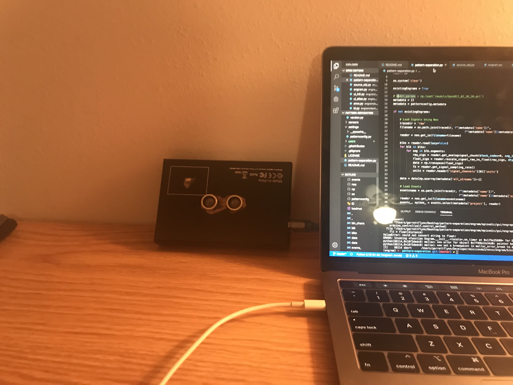
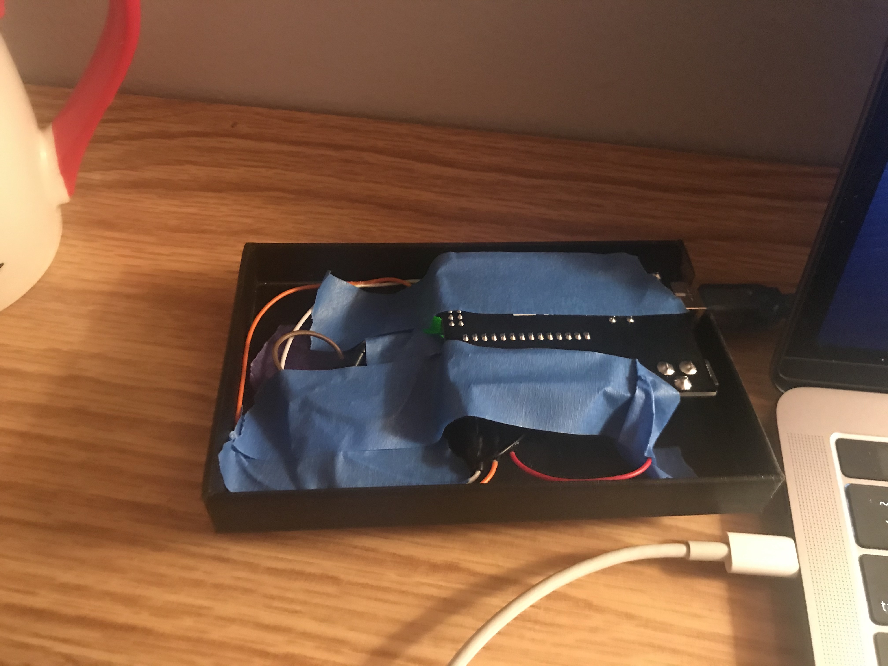

# pattern-separation
 A gesture-controlled interface for visualizing hippocampal dynamics

In the human brain, the hippocampus is theorized to transform non-simultaneous input patterns into less similar output patterns in a process known as "pattern separation", allowing us to distinguish similar memories from one another.

In **pattern-separation**, we created a custom version of Visbrain to visualize the dynamic activity of the hippocampus during a delayed match-to-sample memory task. Additionally, an Arduino distance sensor was used as a gesture-controlled interface to increase/decrease the amount of "pattern separation" within the Visbrain window.

## Getting Started

### Installation

*Coming soon*

### Arduino Setup

#### Tinkercad Circuit Diagram

*Coming soon*

## Support

If you are having issues, please email me at garrett@garrettflynn.com

## Bonus Material
### Process
#### Distance Sensor Prototype

#### Integrated IR-Distance | Form #1

